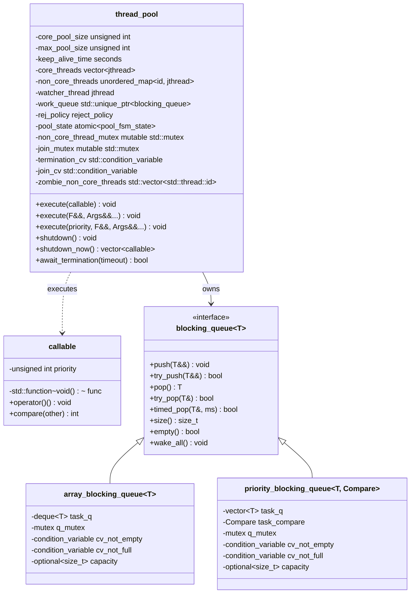
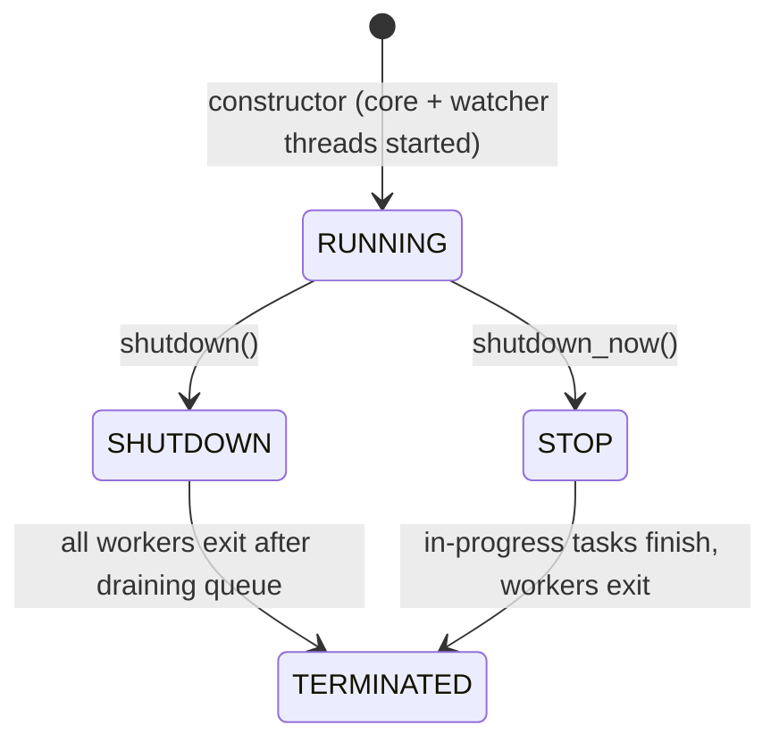

# thread_pool Design Document

<!-- TOC -->
- [1. Overview](#1-overview)
- [2. Core Classes](#2-core-classes)
  - [2.1. `callable`Task Wrapper](#21-callabletask-wrapper)
  - [2.2. `blocking_queue<T>`Queue Interface](#22-blocking_queuetqueue-interface)
  - [2.3. `array_blocking_queue<T>`FIFO Implementation](#23-array_blocking_queuetfifo-implementation)
  - [2.4. `priority_blocking_queue<T, Compare>`Priority Implementation](#24-priority_blocking_queuet-comparepriority-implementation)
  - [2.5. `reject_policy`Rejection Policy Enum](#25-reject_policyrejection-policy-enum)
  - [2.6. `pool_fsm_state`Lifecycle State Enum](#26-pool_fsm_statelifecycle-state-enum)
  - [2.7. `thread_pool`Thread Pool](#27-thread_poolthread-pool)
- [3. Class Diagram](#3-class-diagram)
- [4. Task Queue Design](#4-task-queue-design)
- [5. Thread Pool Lifecycle](#5-thread-pool-lifecycle)
- [6. Thread Management](#6-thread-management)
  - [6.1. Core Threads (eager creation)](#61-core-threads-eager-creation)
  - [6.2. Non-core Threads (on-demand creation)](#62-noncore-threads-ondemand-creation)
  - [6.3. Watcher Thread](#63-watcher-thread)
  - [6.4. No Detachment Policy](#64-no-detachment-policy)
- [7. Exception Handling](#7-exception-handling)
- [8. Rejection Policies](#8-rejection-policies)
- [9. Interface Reference](#9-interface-reference)
  - [9.1. blocking_queue<T>](#91-blocking_queuet)
  - [9.2. callable](#92-callable)
  - [9.3. thread_pool](#93-thread_pool)
- [10. Usage Examples](#10-usage-examples)
  - [10.1. FIFO queue](#101-fifo-queue)
  - [10.2. Priority queue](#102-priority-queue)
- [11. Code Coverage](#11-code-coverage)
<!-- /TOC -->

## 1. Overview

This project implements a C++20 thread pool modeled after Java's `ThreadPoolExecutor`. The design emphasizes:

- **Interface-based architecture**: `blocking_queue` is an abstract interface, allowing pluggable implementations
- **Move semantics**: tasks (`callable`) are moved through the pipeline, avoiding unnecessary copies of `std::function`
- **Priority support**: `callable` carries an unsigned priority; `execute()` submits tasks with explicit priority for priority-queue ordering
- **Eager core threads**: all core threads are created at construction time and poll the queue with a timed wait
- **On-demand non-core threads**: spawned when the queue is full, exit after idle timeout
- **Watcher thread**: a dedicated background thread that joins terminated non-core threads and notifies `await_termination`
- **No detachment**: all threads are unconditionally joined via `std::jthread`, preventing use-after-free and memory leaks
- **Exception safety**: worker threads catch all exceptions thrown by user tasks, preventing `std::terminate`

## 2. Core Classes

### 2.1. `callable`Task Wrapper

```cpp
class callable {
public:
    static constexpr unsigned int DEFAULT_PRIORITY = std::numeric_limits<unsigned int>::min();

    callable() noexcept;                                       // empty callable
    explicit callable(const unsigned int _priority) noexcept;  // empty with priority
    explicit callable(std::function<void()> _func);            // task with DEFAULT_PRIORITY
    callable(std::function<void()> _func, const unsigned int _priority); // task with explicit priority

    void operator()() const;
    int compare(const callable &other) const noexcept;
};
```

- Lightweight wrapper around `std::function<void()>`
- Supports an `unsigned int` priority for priority-queue ordering
- `operator()()` invokes the function; no-op if empty
- `compare()` returns -1, 0, or 1 for three-way priority comparison

### 2.2. `blocking_queue<T>`Queue Interface

```cpp
template<typename T>
class blocking_queue {
public:
    virtual ~blocking_queue() = default;
    virtual void push(T&&) = 0;
    virtual bool try_push(T&&) = 0;
    virtual T pop() = 0;
    virtual bool try_pop(T &item) = 0;
    virtual bool timed_pop(T &item, std::chrono::milliseconds timeout) = 0;
    virtual size_t size() const = 0;
    virtual bool empty() const = 0;
    virtual void wake_all() = 0;
};
```

- Abstract blocking queue interface
- `T` is `callable` in the thread pool context
- `wake_all()` unblocks all threads waiting on `pop()` / `timed_pop()` (used during shutdown)

### 2.3. `array_blocking_queue<T>`FIFO Implementation

- Backed by `std::deque<T>`
- Optional bounded capacity (unbounded if `std::nullopt`)
- Producers push to the back under lock and notify one consumer
- Consumers pop from the front under lock and notify one producer
- `pop()` blocks on a `condition_variable` with `!task_q.empty()` predicate

### 2.4. `priority_blocking_queue<T, Compare>`Priority Implementation

- Backed by `std::vector<T>` with manual heap operations (`push_heap` / `pop_heap`)
- Same locking and notification strategy as FIFO, but with heap ordering via `Compare`
- Default `Compare` is `callable_priority_less`, which orders `callable` by priority (higher priority = dequeued first). The default template parameter `Compare = callable_priority_less` makes the second type argument optional.

**Type aliases** (defined in `thread_pool.hpp`):

```cpp
using fifo_task_queue = array_blocking_queue<callable>;
using priority_task_queue = priority_blocking_queue<callable>; // Compare defaults to callable_priority_less
```

### 2.5. `reject_policy`Rejection Policy Enum

```cpp
enum class reject_policy {
    abort,         ///< Throw rejected_execution_exception.
    caller_runs,   ///< Execute the task in the calling thread.
    discard,       ///< Silently drop the task.
    discard_oldest ///< Remove the oldest queued task and retry enqueue.
};
```

Applied when a task cannot be accepted (queue full and max threads reached).

### 2.6. `pool_fsm_state`Lifecycle State Enum

```cpp
enum class pool_fsm_state {
    running,  ///< Accepting and executing tasks.
    shutdown, ///< No new tasks accepted; queued tasks will be drained.
    stop      ///< No new tasks accepted; in-progress tasks finish but queued tasks are discarded.
};
```

### 2.7. `thread_pool`Thread Pool

Manages worker threads and task dispatching according to Java `ThreadPoolExecutor` semantics.

`thread_pool` is **non-copyable and non-movable**.

Constructors accept `std::chrono::seconds` or `std::chrono::minutes` for `keep_alive_time`:

```cpp
thread_pool(const unsigned int _core_pool_size, const unsigned int _max_pool_size,
            const std::chrono::seconds _keep_alive_time, std::unique_ptr<blocking_queue<callable>> _work_queue,
            const reject_policy _rej_policy = reject_policy::abort);

thread_pool(const unsigned int _core_pool_size, const unsigned int _max_pool_size,
            const std::chrono::minutes _keep_alive_time, std::unique_ptr<blocking_queue<callable>> _work_queue,
            const reject_policy _rej_policy = reject_policy::abort);
```

**Validation**: `core_pool_size` must be ≤ `max_pool_size`.

Task dispatch flow (`submit_task`):

1. If pool is not running → throw `rejected_execution_exception`
2. Try to enqueue the task (`try_push`)
3. If enqueue fails (queue full) and non-core capacity available → create a non-core worker with the task as its initial task
4. Otherwise → apply the rejection policy

## 3. Class Diagram



## 4. Task Queue Design

The task queue is a pluggable component injected via the constructor. Both implementations support:

- **Bounded capacity**: optional maximum size; `try_push` returns false when full
- **Blocking operations**: `push()` and `pop()` block until space/items are available
- **Timed operations**: `timed_pop()` returns false on timeout (used by core workers for periodic state checks)
- **Wake-all**: `wake_all()` unblocks all waiting threads during shutdown transitions

Shutdown does **not** use poison pills. Instead, workers check `pool_state` after each `timed_pop` timeout or `wake_all` signal and exit based on the current state.

## 5. Thread Pool Lifecycle



| State | Behavior |
|-------|----------|
| `running` | Accepts new tasks; core threads poll queue; non-core threads poll with keep-alive timeout |
| `shutdown` | Rejects new tasks; workers drain remaining tasks then exit when queue is empty |
| `stop` | Rejects new tasks; queued tasks are returned to caller; workers exit after current task |
| TERMINATED | All workers exited; `await_termination` returns true |

## 6. Thread Management

### 6.1. Core Threads (eager creation)

- All `core_pool_size` threads are created in the constructor as `std::jthread`.
- Core threads run `core_worker_loop()`: poll the queue with `timed_pop(std::chrono::milliseconds(1000))` in a loop.
- On timeout, they re-check `pool_state`:
  - `stop` → exit immediately
  - `shutdown` + queue empty → exit
  - Otherwise → continue polling

### 6.2. Non-core Threads (on-demand creation)

- Created only when the queue is full and `core_pool_size + non_core_threads.size() < max_pool_size`.
- Non-core threads run `non_core_worker_loop(const callable &initial_task)`:
  1. Execute the initial task immediately
  2. Enter keep-alive polling: `timed_pop(keep_alive_time)`
  3. Exit on idle timeout or when `pool_state != running`
- On exit, they register their thread ID in `zombie_non_core_threads` and notify the watcher thread.

### 6.3. Watcher Thread

A dedicated `std::jthread` that runs `watcher_thread_loop()`:

1. Waits on `join_cv` for zombie thread IDs or a non-running state signal
2. Joins each zombie thread and removes it from `non_core_threads` map
3. When the map is empty and the pool is no longer running, notifies `termination_cv` and exits

This design avoids having worker threads join themselves (undefined behavior) and keeps the `non_core_threads` map consistent.

### 6.4. No Detachment Policy

Threads are **never** detached. The destructor calls `shutdown()` (if still running), then `join_all_threads()`, then joins the watcher thread. If tasks are deadlocked, the destructor blocks indefinitely. Callers should ensure tasks are well-behaved or call `shutdown()`/`await_termination()` explicitly before destruction.

## 7. Exception Handling

User tasks are executed inside worker loops:

```cpp
try {
    task();
} catch (...) {
    // swallow exception
}
```

All exceptions thrown by user code are caught and silently swallowed. This guarantees that a misbehaving task will **not** crash the entire process via `std::terminate`.

## 8. Rejection Policies

| Policy | Behavior |
|--------|----------|
| `abort` | Throws `rejected_execution_exception` |
| `caller_runs` | Runs the task synchronously in the caller thread (only if pool is `running`) |
| `discard` | Silently drops the task |
| `discard_oldest` | Discards the oldest queued task and retries enqueue **once**; if retry fails, the task is silently dropped |

## 9. Interface Reference

### 9.1. blocking_queue<T>

| Method | Description |
|--------|-------------|
| `push(T&&)` | Blocking enqueue, waits if queue is full |
| `try_push(T&&)` | Non-blocking enqueue, returns `false` if full |
| `pop()` | Blocking dequeue |
| `try_pop(T&)` | Non-blocking dequeue, returns `false` if empty |
| `timed_pop(T&, timeout)` | Blocking dequeue with timeout |
| `size()` | Queue size snapshot |
| `empty()` | Returns true if queue is empty (snapshot) |
| `wake_all()` | Wake up all threads blocked on `pop()` / `timed_pop()` |

### 9.2. callable

```cpp
tp::callable task([] { /* ... */ });               // default priority (0)
tp::callable task([] { /* ... */ }, 10);           // explicit priority
```

- `DEFAULT_PRIORITY` = `std::numeric_limits<unsigned int>::min()` (0)
- Higher priority value = scheduled earlier in priority queues
- `operator()()` invokes the function; no-op if empty

### 9.3. thread_pool

| Method | Description |
|--------|-------------|
| `execute(callable)` | Submit a pre-built `callable` task |
| `execute(F&&, Args&&...)` | Submit any callable with arguments (auto-wrapped at default priority) |
| `execute(priority, F&&, Args&&...)` | Submit with explicit priority |
| `shutdown()` | Graceful shutdown: no new tasks accepted, queued tasks are drained |
| `shutdown_now()` | Immediate shutdown: returns unexecuted queued tasks |
| `await_termination(timeout)` | Wait for all threads to exit; 0 = wait indefinitely |

## 10. Usage Examples

### 10.1. FIFO queue

```cpp
#include <chrono>
#include <cstdio>
#include <memory>

#include <threadpool/blocking_queue.hpp>
#include <threadpool/thread_pool.hpp>

void func_no_arg() {
    printf("no-arg function\n");
}

void func_with_args(int x, int y) {
    printf("%d * %d = %d\n", x, y, x * y);
}

int main() {
    auto queue = std::make_unique<tp::fifo_task_queue>(8);
    tp::thread_pool pool(2, 4, std::chrono::seconds(30), std::move(queue));

    pool.execute([] { printf("lambda task\n"); });
    pool.execute([](int a, int b) { printf("%d + %d = %d\n", a, b, a + b); }, 3, 4);
    pool.execute(func_no_arg);
    pool.execute(func_with_args, 6, 7);

    pool.shutdown();
    pool.await_termination(std::chrono::seconds(5));
}
```

### 10.2. Priority queue

```cpp
#include <chrono>
#include <cstdio>
#include <memory>

#include <threadpool/blocking_queue.hpp>
#include <threadpool/thread_pool.hpp>

void func_no_arg() {
    printf("no-arg function\n");
}

void func_with_args(int x, int y) {
    printf("%d * %d = %d\n", x, y, x * y);
}

int main() {
    auto queue = std::make_unique<tp::priority_task_queue>(); // Compare defaults to callable_priority_less
    tp::thread_pool pool(1, 2, std::chrono::seconds(10), std::move(queue));

    pool.execute(1, [] { printf("low\n"); });
    pool.execute(9, [] { printf("high\n"); });
    pool.execute(func_no_arg);
    pool.execute(func_with_args, 6, 7);

    pool.shutdown();
    pool.await_termination(std::chrono::seconds(5));
}
```

## 11. Code Coverage

Build with coverage enabled, run tests, then generate an HTML report with `gcovr`:

```shell
# Meson
meson setup meson-build -Dbuild_tests=true -Denable_codecover=true
meson compile -C meson-build -j$(nproc)
meson test -C meson-build -j$(nproc)

# CMake
cmake -B cmake-build -DTP_BUILD_TESTS=ON -DTP_ENABLE_CODECOVER=ON
cmake --build cmake-build -j$(nproc)
ctest --test-dir cmake-build -j$(nproc)
```

Generate the report (excludes test files):

```shell
# Summary report
gcovr -r . meson-build \
    --gcov-ignore-parse-errors=negative_hits.warn \
    --exclude 'tests\/.*' \
    --html -o coverage.html

# Detailed per-file report
mkdir -p coverage
gcovr -r . meson-build \
    --gcov-ignore-parse-errors=negative_hits.warn \
    --exclude 'tests\/.*' \
    --html-details -o coverage/report.html
```
