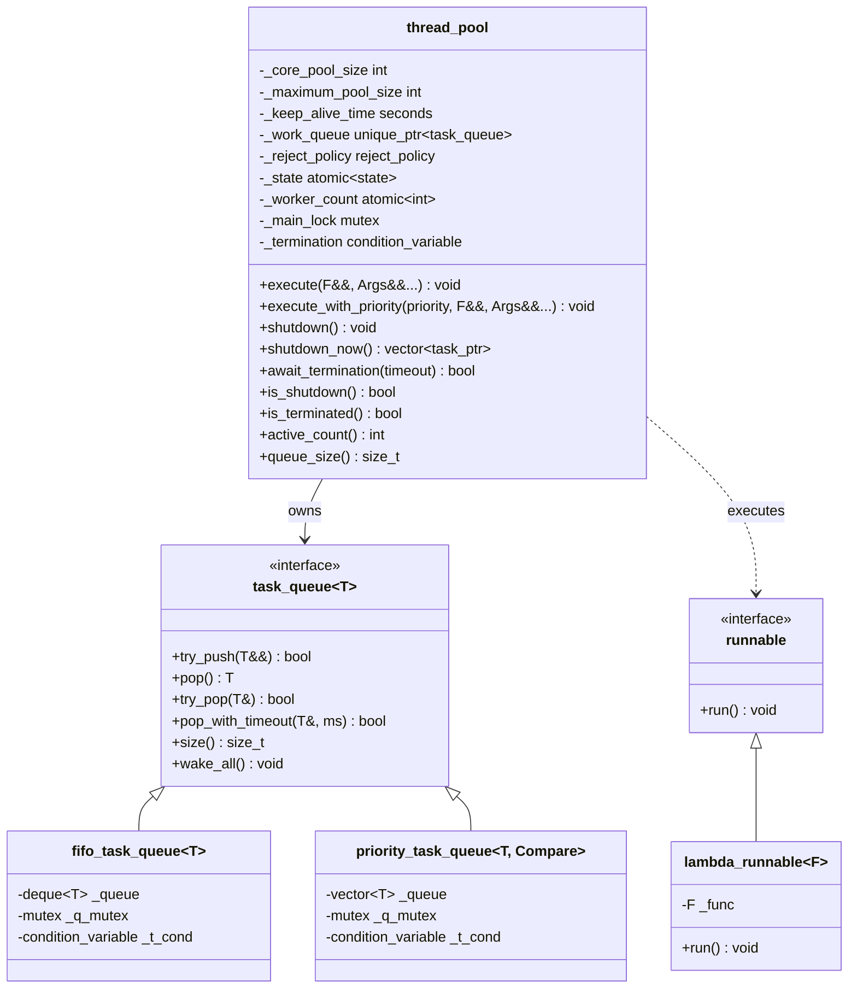
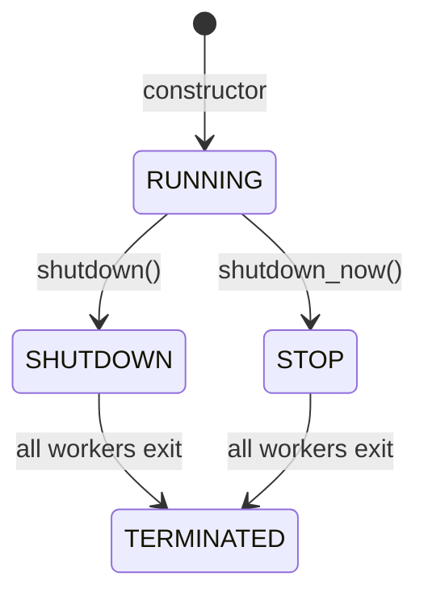

# thread_pool Design Document

<!-- TOC -->
- [1. Overview](#1.-overview)
- [2. Core Classes](#2.-core-classes)
  - [2.1. `runnable` — Task Interface](#2.1.-%60runnable%60-%E2%80%94-task-interface)
  - [2.2. `task_queue<T>` — Queue Interface](#2.2.-%60task_queue%3Ct%3E%60-%E2%80%94-queue-interface)
  - [2.3. `fifo_task_queue<T>` — FIFO Implementation](#2.3.-%60fifo_task_queue%3Ct%3E%60-%E2%80%94-fifo-implementation)
  - [2.4. `priority_task_queue<T, Compare>` — Priority Implementation](#2.4.-%60priority_task_queue%3Ct%2C-compare%3E%60-%E2%80%94-priority-implementation)
  - [2.5. `reject_policy` — Rejection Policy Enum](#2.5.-%60reject_policy%60-%E2%80%94-rejection-policy-enum)
  - [2.6. `state` — Lifecycle State Enum](#2.6.-%60state%60-%E2%80%94-lifecycle-state-enum)
  - [2.7. `thread_pool` — Thread Pool](#2.7.-%60thread_pool%60-%E2%80%94-thread-pool)
- [3. Class Diagram](#3.-class-diagram)
- [4. Task Queue Design](#4.-task-queue-design)
  - [4.1. Poison Pill Shutdown](#4.1.-poison-pill-shutdown)
- [5. Thread Pool Lifecycle](#5.-thread-pool-lifecycle)
- [6. Rejection Policies](#6.-rejection-policies)
<!-- /TOC -->

## 1. Overview

This project implements a C++ thread pool modeled after Java's `ThreadPoolExecutor`. The design emphasizes:

- **Interface-based architecture**: `task_queue` and `runnable` are abstract interfaces, allowing pluggable implementations
- **Move semantics**: tasks are stored as `std::unique_ptr<runnable>`, avoiding type erasure overhead and copying
- **Priority support**: `runnable` carries an unsigned priority; `execute_with_priority()` submits tasks with explicit priority for priority-queue ordering
- **Core vs. non-core threads**: core threads persist indefinitely; non-core threads are culled after idle timeout

## 2. Core Classes

### 2.1. `runnable` — Task Interface

```cpp
class runnable {
public:
    virtual ~runnable() = default;
    virtual void run() = 0;
};
```

- Pure abstract interface for executable tasks
- `lambda_runnable<F>` adapts any callable (lambdas, function objects, `std::bind` results) into a `runnable`

### 2.2. `task_queue<T>` — Queue Interface

```cpp
template<typename T>
class task_queue {
public:
    virtual ~task_queue() = default;
    virtual bool try_push(T&&) = 0;
    virtual T pop() = 0;
    virtual bool try_pop(T&) = 0;
    virtual bool pop_with_timeout(T&, std::chrono::milliseconds) = 0;
    virtual size_t size() const = 0;
    virtual void wake_all() = 0;
};
```

- Abstract blocking queue interface
- `T` is `std::unique_ptr<runnable>` in the thread pool context

### 2.3. `fifo_task_queue<T>` — FIFO Implementation

- Double-buffered `std::deque<T>`
- Producers append to `_write_buffer`; consumers read from `_read_buffer`
- Buffers are swapped under lock when `_read_buffer` is empty

### 2.4. `priority_task_queue<T, Compare>` — Priority Implementation

- Double-buffered `std::vector<T>` with manual heap operations (`push_heap` / `pop_heap`)
- Same lock-swapping strategy as FIFO, but with heap ordering via `Compare`

### 2.5. `reject_policy` — Rejection Policy Enum

```cpp
enum class reject_policy {
    abort,         // throw std::runtime_error
    caller_runs,   // execute in caller thread
    discard,       // silently drop
    discard_oldest // remove oldest queued task and retry
};
```

Applied when a task cannot be accepted (queue full and max threads reached).

### 2.6. `state` — Lifecycle State Enum

```cpp
enum class state {
    running,   // accepting tasks
    shutdown,  // draining queue, no new tasks
    stop       // immediate exit
};
```

### 2.7. `thread_pool` — Thread Pool

Manages worker threads and task dispatching according to Java `ThreadPoolExecutor` semantics.

Constructors accept `std::chrono::seconds` or `std::chrono::minutes` for `keep_alive_time`, internally converted to milliseconds:

```cpp
thread_pool(int core, int max, std::chrono::seconds keep_alive,
            std::unique_ptr<task_queue<task_ptr>> queue, reject_policy policy);

thread_pool(int core, int max, std::chrono::minutes keep_alive,
            std::unique_ptr<task_queue<task_ptr>> queue, reject_policy policy);
```

Task dispatch flow:

1. If `active_count < core_pool_size`, create a new worker thread to execute the task directly
2. Otherwise, try to enqueue the task
3. If enqueue fails (queue full) and `active_count < maximum_pool_size`, create a non-core worker
4. Otherwise, apply the rejection policy

## 3. Class Diagram



## 4. Task Queue Design

### 4.1. Poison Pill Shutdown

`thread_pool::shutdown()` pushes one `nullptr` (empty `unique_ptr`) per worker into the queue. When a worker pops a `nullptr`, it treats it as a poison pill and exits. This avoids needing an interrupt mechanism like Java's `Thread.interrupt()`.

## 5. Thread Pool Lifecycle



| State | Behavior |
|-------|----------|
| `RUNNING` | Accepts new tasks; workers block on queue |
| `SHUTDOWN` | Rejects new tasks; workers drain queue then exit |
| `STOP` | Rejects new tasks; workers exit immediately |
| `TERMINATED` | All workers exited; `await_termination` returns |

## 6. Rejection Policies

| Policy | Behavior |
|--------|----------|
| `abort` | Throws `std::runtime_error` |
| `caller_runs` | Runs the task synchronously in the caller thread |
| `discard` | Silently drops the task |
| `discard_oldest` | Discards the oldest queued task and retries enqueue; falls back to `caller_runs` if queue is empty |

