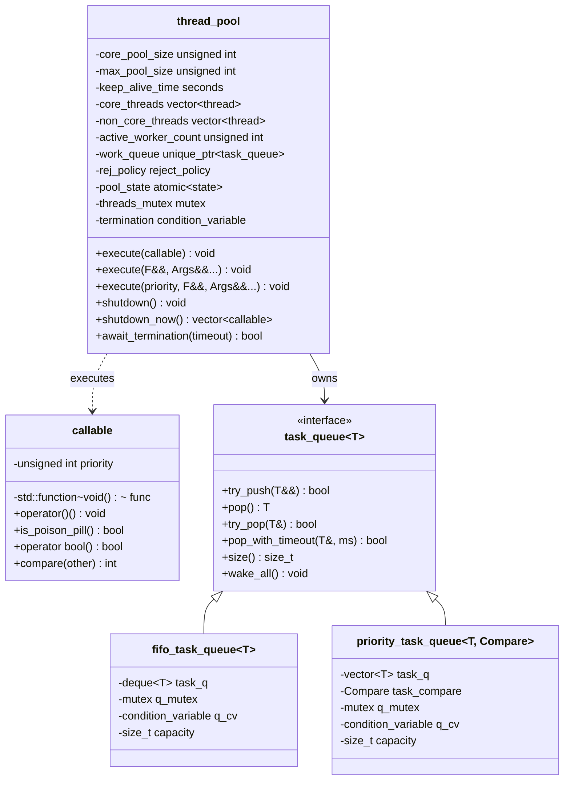
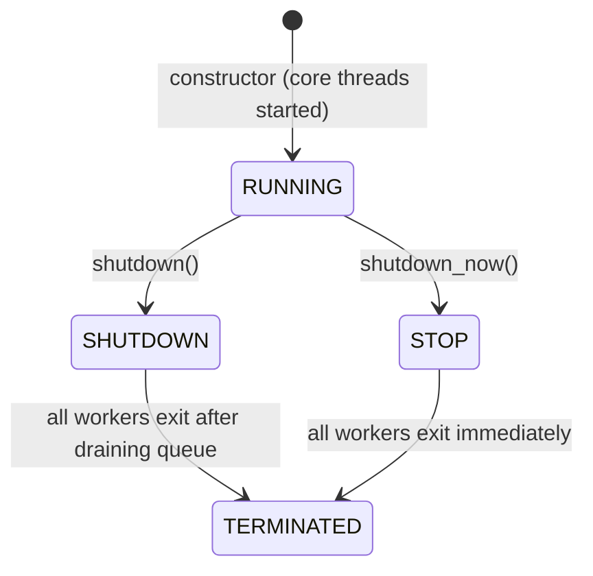

# thread_pool Design Document

<!-- TOC -->
- [1. Overview](#1.-overview)
- [2. Core Classes](#2.-core-classes)
  - [2.1. `callable` — Task Wrapper](#2.1.-%60callable%60-%E2%80%94-task-wrapper)
  - [2.2. `task_queue<T>` — Queue Interface](#2.2.-%60task_queue%3Ct%3E%60-%E2%80%94-queue-interface)
  - [2.3. `fifo_task_queue<T>` — FIFO Implementation](#2.3.-%60fifo_task_queue%3Ct%3E%60-%E2%80%94-fifo-implementation)
  - [2.4. `priority_task_queue<T, Compare>` — Priority Implementation](#2.4.-%60priority_task_queue%3Ct%2C-compare%3E%60-%E2%80%94-priority-implementation)
  - [2.5. `reject_policy` — Rejection Policy Enum](#2.5.-%60reject_policy%60-%E2%80%94-rejection-policy-enum)
  - [2.6. `state` — Lifecycle State Enum](#2.6.-%60state%60-%E2%80%94-lifecycle-state-enum)
  - [2.7. `thread_pool` — Thread Pool](#2.7.-%60thread_pool%60-%E2%80%94-thread-pool)
- [3. Class Diagram](#3.-class-diagram)
- [4. Task Queue Design](#4.-task-queue-design)
  - [4.1. Poison Pill Shutdown](#4.1.-poison-pill-shutdown)
- [5. Thread Pool Lifecycle](#5.-thread-pool-lifecycle)
- [6. Thread Management](#6.-thread-management)
  - [6.1. Core Threads (eager creation)](#6.1.-core-threads-%28eager-creation%29)
  - [6.2. Non-core Threads (on-demand creation)](#6.2.-non-core-threads-%28on-demand-creation%29)
  - [6.3. No Detachment Policy](#6.3.-no-detachment-policy)
- [7. Exception Handling](#7.-exception-handling)
- [8. Rejection Policies](#8.-rejection-policies)
- [9. Interface Reference](#9.-interface-reference)
  - [9.1. task_queue<T>](#9.1.-task_queue%3Ct%3E)
  - [9.2. callable](#9.2.-callable)
  - [9.3. thread_pool](#9.3.-thread_pool)
- [10. Usage Examples](#10.-usage-examples)
  - [10.1. FIFO queue](#10.1.-fifo-queue)
  - [10.2. Priority queue](#10.2.-priority-queue)
- [11. Code Coverage](#11.-code-coverage)
<!-- /TOC -->

## 1. Overview

This project implements a C++ thread pool modeled after Java's `ThreadPoolExecutor`. The design emphasizes:

- **Interface-based architecture**: `task_queue` is an abstract interface, allowing pluggable implementations
- **Move semantics**: tasks (`callable`) are moved through the pipeline, avoiding unnecessary copies of `std::function`
- **Priority support**: `callable` carries an unsigned priority; `execute()` submits tasks with explicit priority for priority-queue ordering
- **Eager core threads**: all core threads are created at construction time and block on the queue
- **On-demand non-core threads**: spawned when the queue is full, exit after idle timeout
- **No detachment**: all threads are unconditionally joined, preventing use-after-free and memory leaks
- **Exception safety**: worker threads catch all exceptions thrown by user tasks, preventing `std::terminate`

## 2. Core Classes

### 2.1. `callable` — Task Wrapper

```cpp
class callable {
public:
    static constexpr unsigned int LOWEST_PRIORITY = std::numeric_limits<unsigned int>::min();
    static constexpr unsigned int HIGHEST_PRIORITY = std::numeric_limits<unsigned int>::max();

    explicit callable(unsigned int _priority) noexcept;       // poison pill
    explicit callable(std::function<void(void)> _func);       // task with LOWEST_PRIORITY
    callable(std::function<void(void)> _func, unsigned int _priority); // task with explicit priority

    void operator()() const;
    bool is_poison_pill() const noexcept;
    explicit operator bool() const noexcept;
    int compare(const callable &other) const noexcept;
};
```

- Lightweight wrapper around `std::function<void()>`
- Supports an `unsigned int` priority for priority-queue ordering
- `callable(priority)` constructs a poison pill (no function, `is_poison_pill()` returns `true`)
- `is_poison_pill()` returns `true` if the callable holds no function (poison pill)
- `operator bool()` returns `true` if the callable is **not** a pill

### 2.2. `task_queue<T>` — Queue Interface

```cpp
template<typename T>
class task_queue {
public:
    virtual ~task_queue() = default;
    virtual void push(T&&) = 0;
    virtual bool try_push(T&&) = 0;
    virtual T pop() = 0;
    virtual bool try_pop(T&) = 0;
    virtual bool pop_with_timeout(T&, std::chrono::milliseconds) = 0;
    virtual size_t size() const = 0;
    virtual void wake_all() = 0;
};
```

- Abstract blocking queue interface
- `T` is `callable` in the thread pool context

### 2.3. `fifo_task_queue<T>` — FIFO Implementation

- Backed by `std::deque<T>`
- Producers push to the back under lock and notify one consumer
- Consumers pop from the front under lock and notify one producer
- `pop()` blocks on a `condition_variable` with `!task_q.empty()` predicate

### 2.4. `priority_task_queue<T, Compare>` — Priority Implementation

- Backed by `std::vector<T>` with manual heap operations (`push_heap` / `pop_heap`)
- Same locking and notification strategy as FIFO, but with heap ordering via `Compare`
- Default `Compare` is `callable_priority_less`, which orders `callable` by priority (higher priority first)
- For non-callable types, provide your own comparator (e.g. `std::less<T>`)

### 2.5. `reject_policy` — Rejection Policy Enum

```cpp
enum class reject_policy {
    abort,         // throw rejected_execution_exception
    caller_runs,   // execute in caller thread
    discard,       // silently drop
    discard_oldest // remove oldest queued task and retry submission once
};
```

Applied when a task cannot be accepted (queue full and max threads reached).

### 2.6. `state` — Lifecycle State Enum

```cpp
enum class state {
    running,   // accepting tasks
    shutdown,  // draining queue, no new tasks
    stop       // immediate exit
};
```

### 2.7. `thread_pool` — Thread Pool

Manages worker threads and task dispatching according to Java `ThreadPoolExecutor` semantics.

`thread_pool` is **non-copyable and non-movable**.

Constructors accept `std::chrono::seconds` or `std::chrono::minutes` for `keep_alive_time`, internally converted to seconds:

```cpp
thread_pool(unsigned int core, unsigned int max, std::chrono::seconds keep_alive,
            std::unique_ptr<task_queue<callable>> queue, reject_policy policy);

thread_pool(unsigned int core, unsigned int max, std::chrono::minutes keep_alive,
            std::unique_ptr<task_queue<callable>> queue, reject_policy policy);
```

**Validation**: `core_pool_size` must be **less than or equal to** `max_pool_size`.

Task dispatch flow:

1. Try to enqueue the task
2. If enqueue fails (queue full) and `active_worker_count < max_pool_size`, create a non-core worker to execute the task directly
3. Otherwise, apply the rejection policy

## 3. Class Diagram



## 4. Task Queue Design

### 4.1. Poison Pill Shutdown

Workers exit when they pop a poison pill (a `callable` where `is_poison_pill()` returns `true`). The priority of the pill controls shutdown semantics:

| Shutdown type | Pill priority | Effect |
|---------------|---------------|--------|
| `shutdown()` (graceful) | `LOWEST_PRIORITY` | Real tasks are consumed first; pills are processed last |
| `shutdown_now()` (immediate) | `HIGHEST_PRIORITY` | Pills are consumed before any remaining tasks |

One pill is pushed per active worker. After pushing pills, `wake_all()` is called to unblock any workers waiting on an empty queue.

For `shutdown_now()`, remaining tasks are drained from the queue **before** pushing pills, and returned to the caller.

## 5. Thread Pool Lifecycle



| State | Behavior |
|-------|----------|
| `RUNNING` | Accepts new tasks; core threads block on queue; non-core threads poll with timeout |
| `SHUTDOWN` | Rejects new tasks; workers consume remaining tasks then exit on poison pill |
| `STOP` | Rejects new tasks; workers exit immediately on poison pill |
| `TERMINATED` | All workers exited; `await_termination` returns |

## 6. Thread Management

### 6.1. Core Threads (eager creation)

- All `core_pool_size` threads are created in the constructor.
- Core threads run `core_worker_loop()`: blocking `pop()` from the queue in a loop.
- They persist until a poison pill is received (shutdown or stop).

### 6.2. Non-core Threads (on-demand creation)

- Created only when the queue is full and `active_worker_count < max_pool_size`.
- Non-core threads run `non_core_worker_loop()`: execute their initial task, then poll with `pop_with_timeout()`.
- They exit after `keep_alive_time` of idleness, or upon receiving a poison pill.

### 6.3. No Detachment Policy

Threads are **never** detached. The destructor calls `shutdown_now()` and unconditionally joins all threads. If tasks are deadlocked, the destructor blocks indefinitely. Callers must ensure tasks are well-behaved or call `shutdown()`/`await_termination()` explicitly before destruction.

## 7. Exception Handling

User tasks are executed inside worker loops:

```cpp
try {
    task();
} catch (...) {
    // swallow exception
}
```

All exceptions thrown by user code are caught and silently swallowed. This guarantees that a misbehaving task will **not** crash the entire process via `std::terminate`.

## 8. Rejection Policies

| Policy | Behavior |
|--------|----------|
| `abort` | Throws `rejected_execution_exception` |
| `caller_runs` | Runs the task synchronously in the caller thread (only if pool is `running`) |
| `discard` | Silently drops the task |
| `discard_oldest` | Discards the oldest queued task and retries submission **once**; if the retry also fails (or the queue is empty), the task is silently dropped |

## 9. Interface Reference

### 9.1. task_queue<T>

| Method | Description |
|--------|-------------|
| `push(T&&)` | Blocking enqueue, waits if queue is full |
| `try_push(T&&)` | Non-blocking enqueue, returns `false` if full |
| `pop()` | Blocking dequeue |
| `try_pop(T&)` | Non-blocking dequeue, returns `false` if empty |
| `pop_with_timeout(T&, timeout)` | Blocking dequeue with timeout |
| `size()` | Queue size snapshot |
| `wake_all()` | Wake up all threads blocked on `pop()` / `pop_with_timeout()` |

### 9.2. callable

```cpp
tp::callable task([] { /* ... */ });               // default priority (LOWEST)
tp::callable task([] { /* ... */ }, 10);           // explicit priority
tp::callable pill(tp::callable::HIGHEST_PRIORITY); // poison pill (no function)
```

- `LOWEST_PRIORITY` = `0`
- `HIGHEST_PRIORITY` = `std::numeric_limits<unsigned int>::max()`
- `is_poison_pill()` returns `true` if the callable is a poison pill (holds no function)

### 9.3. thread_pool

| Method | Description |
|--------|-------------|
| `execute(callable)` | Submit a pre-built `callable` task |
| `execute(F&&, Args&&...)` | Submit any callable with arguments (auto-wrapped) |
| `execute(priority, F&&, Args&&...)` | Submit with explicit priority |
| `shutdown()` | Graceful shutdown: no new tasks accepted, queued tasks are executed |
| `shutdown_now()` | Immediate shutdown: returns a list of unexecuted tasks |
| `await_termination(timeout)` | Wait for all threads to exit (`std::chrono::seconds`, negative = infinite) |

## 10. Usage Examples

### 10.1. FIFO queue

```cpp
#include <iostream>
#include <memory>
#include "threadpool/task_queue.hpp"
#include "threadpool/thread_pool.hpp"

void task_func(int id) {
    std::cout << "Processing " << id << "\n";
}

struct task_obj {
    void operator()(int a, int b) const {
        std::cout << a << " + " << b << " = " << (a + b) << "\n";
    }
};

int main() {
    auto work_queue = std::make_unique<tp::fifo_task_queue<tp::callable>>();
    tp::thread_pool pool(4, 8, std::chrono::seconds(60), std::move(work_queue));

    // 1. Stateless lambda
    pool.execute([] { std::cout << "Hello from thread pool\n"; });

    // 2. Lambda with captures and arguments
    int factor = 10;
    pool.execute([factor](int x) { std::cout << "Result: " << x * factor << "\n"; }, 5);

    // 3. Ordinary function with arguments
    pool.execute(task_func, 42);

    // 4. Function object
    pool.execute(task_obj{}, 3, 4);

    pool.shutdown();
    pool.await_termination(std::chrono::seconds(5));
    return 0;
}
```

### 10.2. Priority queue

```cpp
#include <iostream>
#include <memory>
#include "threadpool/task_queue.hpp"
#include "threadpool/thread_pool.hpp"

int main() {
    auto work_queue = std::make_unique<tp::priority_task_queue<tp::callable>>();
    tp::thread_pool pool(4, 8, std::chrono::seconds(60), std::move(work_queue));

    // Higher priority value = earlier execution
    pool.execute(1, [] { std::cout << "low\n"; });
    pool.execute(5, [] { std::cout << "high\n"; });
    pool.execute(3, [] { std::cout << "medium\n"; });

    pool.shutdown();
    pool.await_termination(std::chrono::seconds(5));
    // Output order: high, medium, low
    return 0;
}
```

## 11. Code Coverage

Build with coverage enabled, run tests, then generate an HTML report with `gcovr`:

```shell
# Meson
meson setup meson-build -Dbuild_tests=true -Denable_codecover=true
meson compile -C meson-build -j$(nproc)
meson test -C meson-build -j$(nproc)

# CMake
cmake -B cmake-build -DTP_BUILD_TESTS=ON -DTP_ENABLE_CODECOVER=ON
cmake --build cmake-build -j$(nproc)
ctest --test-dir cmake-build -j$(nproc)
```

Generate the report (excludes test files):

```shell
# Summary report
gcovr -r . meson-build \
    --gcov-ignore-parse-errors=negative_hits.warn \
    --exclude 'tests\/.*' \
    --html -o coverage.html

# Detailed per-file report
mkdir -p coverage
gcovr -r . meson-build \
    --gcov-ignore-parse-errors=negative_hits.warn \
    --exclude 'tests\/.*' \
    --html-details -o coverage/report.html
```
